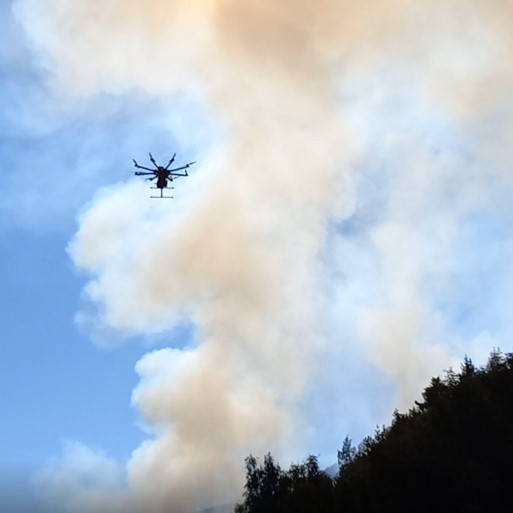

# uav_wildfire
## Unmanned Aerial Vehicle Swarms for Large-Scale, Real-Time, and Intelligent Disaster Responses

## Introduction
The aim of this project is to develop and test a swarm of unmanned aerial vehicles (UAVs) that is capable of monitoring air pollution emitted by wildfires and to understand the effects of the pollution on human health. An octocopter UAV, equipped with a customized air quality sensor package and a volatile organic compound (VOC) air sampler has been developed and successfully tested during several prescribed fires conducted by the *California Department of Forestry and Fire Protection* ([CAL FIRE](https://www.fire.ca.gov/)).

The video is available on YouTube (click):

## Datasets
Our experiment datasets can be download [here](https://drive.google.com/drive/folders/1dLcnC4mP8gCwBGYy3MEUzfnSb1v5YxFl?usp=sharing).

## Acknowledgements
This project is funded by ***Sony Group Corporation*** and ***CITRIS and the Banatao Institute***.

## Licence
The source code is released under [GPLv3](http://www.gnu.org/licenses/) license.